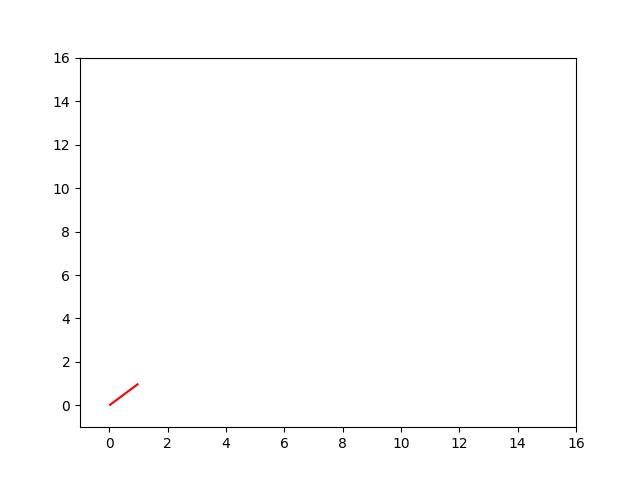

# Best first search, using pre-sorted iterators

It finds the minimum cost path on a graph, where the cost of a path is linear sum of each edge's weight in it. To call the function, the followings are required:

- termination condition
- neighbor iterator; pre sorting the iterator helps the performance so that it iterates through each neighbor in ascending order of cost.
- cost addition function; in case you want to inject relaxation

For usage, take a look at `best_first_search.example`.
